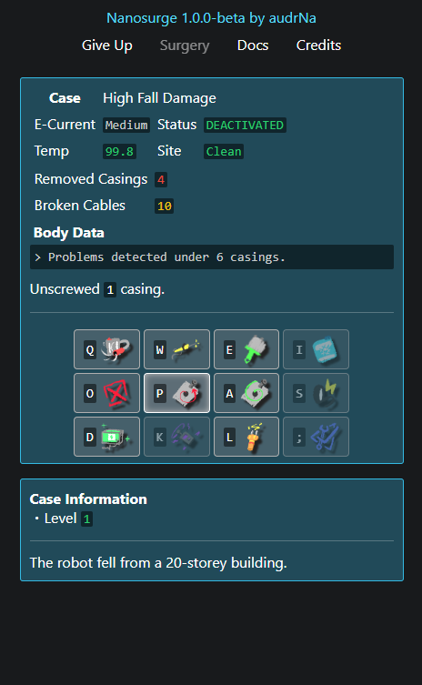
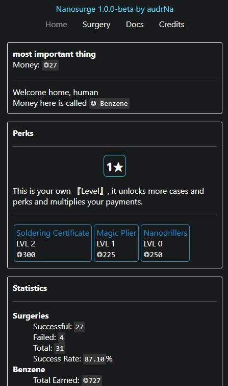

# Nanosurge
A text and button client-side web game where you perform surgery on robots, inspired by [Growtopia](https://www.growtopiagame.com/)'s surgery feature.

# How to play
You can play at https://audrna.github.io/Nanosurge/ or download this repository and play locally. Once the game is opened:
+ At the top, there is a navigation bar with links. You can start the main game by going to the Surgery page.
+ You can learn how to play by going to the Docs.

# Screenshots
 

# Status
(audrNa) This is a project I've worked on for 2 months for learning. There are more things I can add to this game but as I am inexperienced, it's best I keep it simple and not go too far with the scope. I published this here on GitHub for my friends to try out. This project is now finished for me, I may still be around to make a few changes or add some new features if I can.
